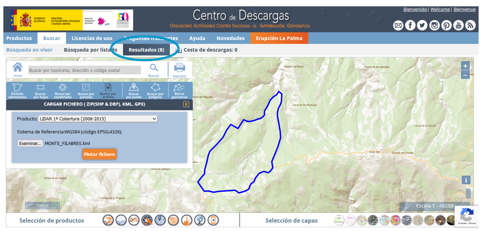
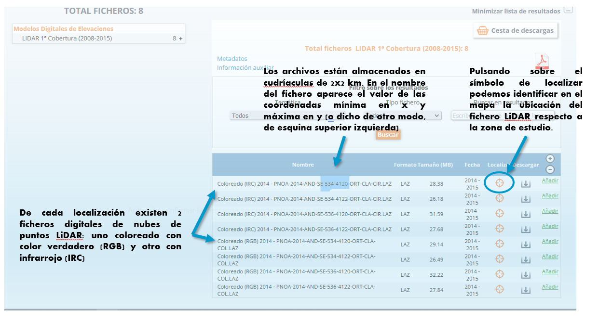
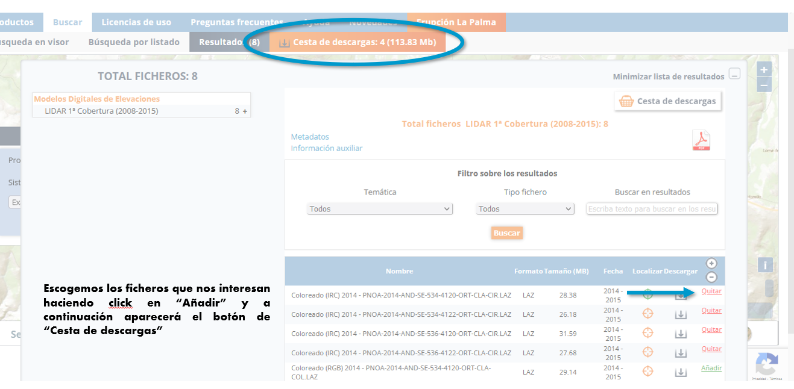
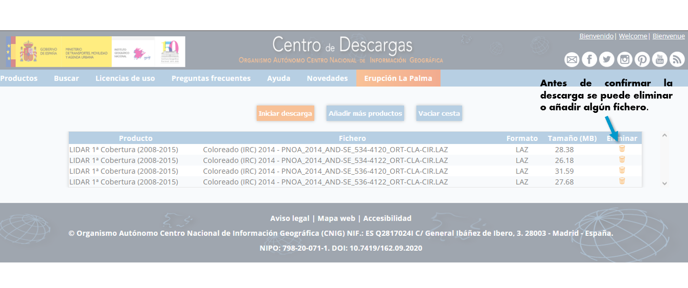
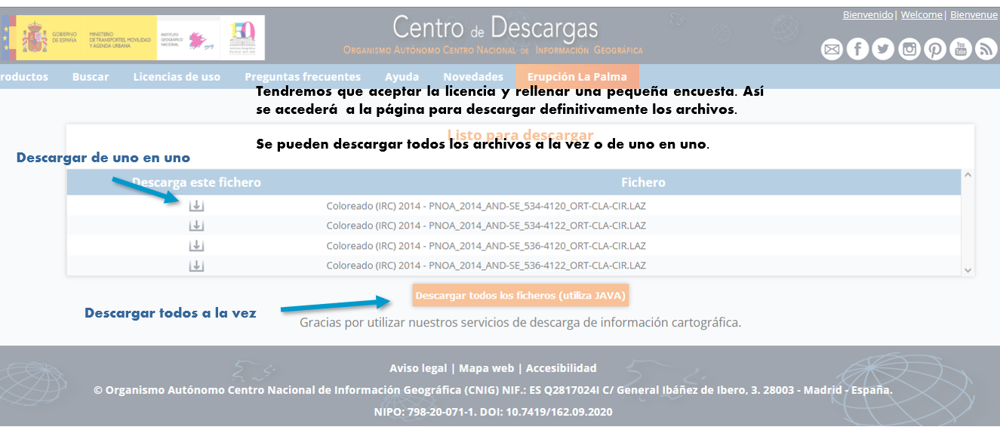
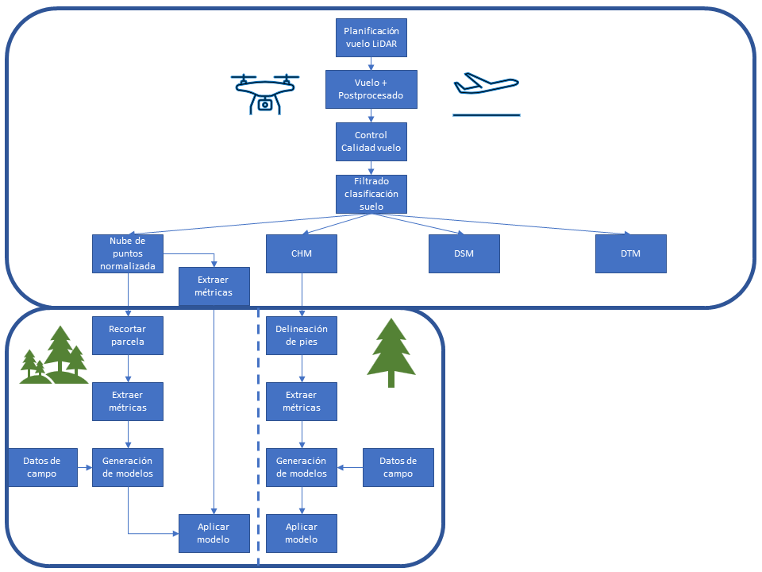

# Capítulo 13: Sensores activos en ciencias forestales: LiDAR

En el presente ejercicio se va a aprender a visualizar y manipular datos LiDAR para conseguir información de la estructura de la vegetación tanto a nivel de masa, como a nivel de árbol individual.

## 1. Descarga de datos LiDAR-PNOA

Para la descarga de datos LiDAR-PNOA de la primera cobertura, se aconseja que se sigan las instrucciones del siguiente video utilizando la zona de estudio descargable en [aqui](./Limite_monte) 

[](https://www.youtube.com/watch?v=2u88We_Zyzg)

A modo de guía, se presentan algunas imágenes:











## 2. Visualización y comprobaciones previas

Dentro de un flujo de trabajo estándar con datos LiDAR, una de las primeras actividades a realizar es una comprobación previa de la nube de puntos que permitirá conocer si son útiles para el propósito que se les pretende asignar.



### 2.1. Introducir los archivos LiDAR

Para la visualización y manipulación de datos LiDAR en contexto forestal se va a emplear la interfaz que proporciona la librería *lidR* en lenguaje R.

```r
library(lidR)
```

#### 2.1.1. Como un catalogo de datos

Un catálogo de datos LiDAR consiste en una representación en R de un conjunto de archivos no cargados en memoria. El peso de los archivos .laz o .las, en ocasiones, es considerable. Cuando, además, se trata de datos con una alta densidad de pulsos, incluso puede fallar el cargar un único archivo. Empleando un catálogo de datos LiDAR, un ordenador o computadora normal podría trabajar con la nube, aunque no fuera capaz de cargarla en memoria.

```r
catalogo<-readLAScatalog("E:/DESCARGA") #Adaptar a la ruta de descarga utilizada
catalogo 
```

```r annotate
## class       : LAScatalog (v1.2 format 3)
## extent      : 534000, 538000, 4118000, 4122000 (xmin, xmax, ymin, ymax)
## coord. ref. : ETRS89 / UTM zone 30N 
## area        : 16 km²
## points      : 19.41million points
## density     : 1.2 points/m²
## num. files  : 4
```

Se puede observar que se trata de un conjunto de 4 archivos con una densidad media de los pulsos de 1.2 puntos/m^2^ que cubre una superficie de 16 km^2^. El sistema de coordenadas es el ETRS89 UTM zona 30N.

El formato LAS contiene datos que se pueden dividir en tres grupos:

-   Bloque de cabecera pública: incluye la información básica del fichero y datos genéricos como el número de puntos y las coordenadas de la extensión espacial que cubre la nube de puntos.

-   Registros de longitud variable: contiene diferentes tipos de datos incluyendo la proyección y los metadatos.

-   Registros de la nube de puntos.

Para ver el bloque de cabecera del catálogo, se puede acceder a la tabla en donde se guardan los principales datos de la cabecera de los archivos LiDAR.

```r
#Ver la cabecera de los datos
catalogo@data
```

File.Signature |	File.Source.ID |	GUID |	Version.Major |	Version.Minor |	System.Identifier |	Generating.Software |	File.Creation.Day.of.Year |	File.Creation.Year |	Header.Size |	Offset.to.point.data |	Number.of.variable.length.records |	Point.Data.Format.ID |	Point.Data.Record.Length |	Number.of.point.records |	X.scale.factor |	Y.scale.factor |	Z.scale.factor |	X.offset |	Y.offset |	Z.offset |	Max.X |	Min.X |	Max.Y |	Min.Y |	Max.Z |	Min.Z |	CRS |	Number.of.1st.return |	Number.of.2nd.return |	Number.of.3rd.return |	Number.of.4th.return |	Number.of.5th.return |	filename |
LASF |	0 |	00000000-0000-0000-0000-000000000000 |	1 |	2 	|	TerraScan |	13 |	2017 |	227 |	633 |	3 |	3 |	34 |	4976583 |	0.001 |	0.001 |	0.001 |	534000 |	4118000 |	0 |	536000 |	534000 |	4120000 |	4118000 |	1963.45 |	1843.33 |	25830 |	3893823 |	1072023 |	10705 |	32 |	0 |	E:/MOOC_LiDAR/Descarga/PNOA_2014_AND-SE_534-4120_ORT-CLA-CIR.laz |
LASF |	0 |	00000000-0000-0000-0000-000000000000 |	1 |	2 	|	TerraScan |	13 |	2017 |	227 |	633 |	3 |	3 |	34 |	4633930 |	0.001 |	0.001 |	0.001 |	534000 |	4120000 |	0 |	536000 |	534000 |	4122000 |	4120000 |	1991.47 |	1698.75 |	25830 |	3970075 |	660084 |	3718 |	53 |	0 |	E:/MOOC_LiDAR/Descarga/PNOA_2014_AND-SE_534-4122_ORT-CLA-CIR.laz |
LASF |	0 |	00000000-0000-0000-0000-000000000000 |	1 |	2 	|	TerraScan |	13 |	2017 |	227 |	633 |	3 |	3 |	34 |	5247509 |	0.001 |	0.001 |	0.001 |	536000 |	4118000 |	0 |	538000 |	536000 |	4120000 |	4118000 |	2060.91 |	1700.38 |	25830 |	4025607 |	1210920 |	10887 |	95 |	0 |	E:/MOOC_LiDAR/Descarga/PNOA_2014_AND-SE_536-4120_ORT-CLA-CIR.laz |
LASF |	0 |	00000000-0000-0000-0000-000000000000 |	1 |	2 	|	TerraScan |	13 |	2017 |	227 |	633 |	3 |	3 |	34 |	4550014 |	0.001 |	0.001 |	0.001 |	536000 |	4120000 |	0 |	538000 |	536000 |	4122000 |	4120000 |	2052.63 |	1547.24 |	25830 |	3698568 |	838536 |	12721 |	189 |	0 |	E:/MOOC_LiDAR/Descarga/PNOA_2014_AND-SE_536-4122_ORT-CLA-CIR.laz |

En él se puede identificar la versión LAS de los datos, el ID del proyecto, el software generador, la fecha de creación del archivo y la extensión del proyecto, entre otra información.

Un paso importante en el procesado de datos LiDAR es asegurarse que los archivos están completos y son válidos. Para ello, se realiza una inspección de la consistecia de los archivos del catálogo a través de la función *las_check()*.

```r
#Validar los datos LiDAR
las_check(catalogo)
```


La función muestra que existen incoherencias respecto a los offsets (compensaciones). Además indica que los datos no están normalizados, ni indexados.

Los campos de offsets deben usarse para establecer la compensación general para la localización de los registros de puntos. En general, estos números serán cero, pero en ciertos casos, la resolución de los datos de puntos puede no ser lo suficientemente grande para un sistema de proyección dado. Sin embargo, siempre se debe suponer que se utilizan estos números. Entonces, para escalar una X dada desde el registro de puntos, tome el registro de puntos X multiplicado por el factor de escala de X y luego agregue el desplazamiento de X.

$X~coordenada~=(X~registrado~*X~escalado~)+X~offset~$

$Y~coordenada~=(Y~registrado~*Y~escalado~)+Y~offset~$

$Z~coordenada~=(Z~registrado~*Z~escalado~)+Z~offset~$

```r
#Valores de offset de los archivos del catalogo. Coordenada X
catalogo@data$X.offset

#Valores de offset de los archivos del catalogo. Coordenada Y
catalogo@data$Y.offset

#Valores de offset de los archivos del catalogo. Coordenada Z
catalogo@data$Z.offset

#Valores mínimos de los archivos del catalogo. Coordenada X
catalogo@data$Min.X

#Valores máximos de los archivos del catalogo. Coordenada X
catalogo@data$Max.X

#Valores mínimos de los archivos del catalogo. Coordenada Y
catalogo@data$Min.Y

#Valores máximos de los archivos del catalogo. Coordenada Y
catalogo@data$Max.Y

#Valores mínimos de los archivos del catalogo. Coordenada Z
catalogo@data$Min.Z

#Valores máximos de los archivos del catalogo. Coordenada Z
catalogo@data$Max.Z
```

El valor de los offsets en X e Y coinciden con sus valores mínimos respectivos en los 4 archivos. Resulta evidente que se trata de un error en la cabecera y que los valores de offset deberían ser 0 en las 3 dimensiones. Para corregir la incosistencia, se cambia el valor de los offsets:

```r
#Corregir la cabecera
catalogo@data$X.offset<-c(0,0,0,0)
catalogo@data$Y.offset<-c(0,0,0,0)
```

```r
#Volvemos a comprobar la validacion de los datos
las_check(catalogo)#Ya está corregido
```


#### 2.1.2. Como un único archivo

Además del catálogo de datos LiDAR, también se puede visualizar un único archivo .las

```r
lidar534_4120<-readLAS("E:/MOOC_LiDAR/Descarga/PNOA_2014_AND-SE_534-4120_ORT-CLA-CIR.laz")
```

La estructura interna de los datos LiDAR se hace accesible al usuario a través de tablas de datos en los que queda recogido, como mínimo, el valor de:

-   Datos inerciales del avión (INS/IMU)
-   Coordenadas "X".
-   Coordenadas "Y".
-   Dato "Elevation": distancia a la superficie.
-   Información de posicionamiento GPS.
-   Dato "Intensidad" que es el valor adimensional de la energía recibida.
-   Número del pulso emitido.
-   Número del pulso reflejado.
-   Ángulo de escaneo.
-   Clasificación del punto.

A veces también se registra:

-   Si el pulso es límite de la linea de vuelo o no
-   Valores en R (Rojo), G (Verde), B (Azul) del color del retorno.

```r
#Vamos a ver el interior de los datos. Sólo los 6 primeros
head(lidar534_4120@data)
```

```r
#Vamos a ver el interior de los datos. Sólo los 6 primeros
kable(head(lidar534_4120@data))%>%
        kable_styling(font_size=10)%>%
        scroll_box(width="900px")
```

### 2.2. Comprobaciones de la información LiDAR

Cuando se recibe un vuelo LiDAR generado por una empresa es necesario realizar un control de calidad para ratificar que los datos cumplen con las condiciones que se han especificado en el pliego de especificaciones técnicas y tienen las condiciones necesarias para el objetivo de nuestro proyectos. Además nos permite indagar las posibles mejoras en las especificaciones de los vuelos futuros según las particularidades de la masa.

#### 2.2.1. Visualizar los datos LiDAR

Visualizar un catalogo de datos LiDAR sobre un mapa permite comprobar que se ajusta a la zona de estudio seleccionada.

```r
#Visualizar el catalogo sobre un mapa
#Necesita tener instalada la libreria mapview
#En caso de no tenerla instalada ejecutar la función install.packaques()
#install.packages("mapview")
library(mapview)
plot(catalogo, map = TRUE, map.type = "Esri.WorldImagery")
```

Para visualizar la nube de puntos en 3 dimensiones se ha seleccionado una zona según sus coordenadas.

##### Con un solo archivo

```r
#Visualizar en 3D
recorte<-clip_rectangle(lidar534_4120, 
                        min(lidar534_4120$X)+1850, 
                        min(lidar534_4120$Y)+1170, 
                        min(lidar534_4120$X)+2000,  
                        min(lidar534_4120$Y)+1320)

plot(recorte)
```


Se pueden cambiar algunas opciones para mejorar la visualización de los datos como el fondo, la presencia de ejes guía en cada dimensión y la presencia de leyenda del mapa.

```r
plot(recorte,bg = "white", axis = TRUE, legend = TRUE)
```


##### Con un catálogo de datos

Para visualizar esta misma zona trabajando desde el catálogo, es necesario ejecutar la función *readLAS()* de la zona que se quiera visualizar, filtrando las coordenadas para no exceder la memoria. Como el primero de los archivos del catálogo es el que corresponde al que se ha visualizado en el paso anterior,

```r
#Nombre de los archivos del catalogo
catalogo@data$filename

#Coordenada X mínima del recorte
catalogo@data$Min.X[1]+1850

#Coordenada Y mínima del recorte
catalogo@data$Min.Y[1]+1170

#Coordenada X máxima del recorte
catalogo@data$Min.X[1]+2000

#Coordenada Y máxima del recorte
catalogo@data$Min.Y[1]+1320

```

```r
#Visualizar recorte del catalogo
recorte_catalogo<-readLAS((catalogo[[34]][1]),select = "xyz",
               filter="-keep_xy 535850 4119170 536000 4119320")

plot(recorte_catalogo)
```


Como se puede observar, el resultado es el mismo.

#### 2.2.2. Distribución espacial de la densidad de pulsos

Una de las comprobaciones cruciales es la densidad de pulsos Con ella se puede determinar si la nube de puntos resulta útil para la finalidad que se le quiera dar según el tipo de masa forestal con la que se esté trabajando, Ya se había determinado en el punto 2.1.1. que los datos que se están usando tienen una densidad media de puntos de 2.1.2. Sin embargo, la distribución de los pulsos puede variar espacialmente en el área de estudio.

Con la función *retrieve_pulses()* se consigue recuperar cada pulso individual usando el tiempo GPS para identificarlos y guardándolo como un atributo extra. A través de él, se consigue crear un mapa de densidades de retornos y de pulsos.

```r
lidar534_4120 <- retrieve_pulses(lidar534_4120)

densidad<-grid_density(lidar534_4120, res = 5)
densidad

#Caracterizacion del raster como de valores discretos
library(raster)
densidad[[2]] <- ratify(densidad[[2]])

library(mapview)
mapview(densidad[[2]],
        col.regions = c("red","green","darkgreen","yellow","orange","red","brown"),
        at = c(0,0.3,1,2,3,4,5))
```

##### Con un catálogo de datos

Para trabajar desde el catalogo de datos LiDAR, se pueden usar las mismas funciones, sustituyendo el argumento *lidar534_4120* por *catalogo*. Los resultados serán extensibles a toda la zona de los 4 archivos LiDAR descargados. El tiempo de procesado se verá incrementado proporcionalmente al aumento de superficie.

```r
densidad_catalogo<-grid_density(catalogo, res = 5)
densidad_catalogo

mapview(densidad_catalogo,
        col.regions = c("red","green","darkgreen","yellow","orange","red","brown"),
        at = c(0,0.3,1,2,3,4,5))
```

Como puede comprobarse, aunque el valor medio de la densidad de puntos del archivo (1.2) supera con creces los requisitos del proyecto LiDAR-PNOA (0.5 pulsos/m^2^), la distribución de los mismos no es homogenea. En las zonas de solape entre líneas de vuelo es considerablemente mayor que en las posiciones intermedias, en las que llegan a encontrarse huecos. Dicha distribución tendrá unas consecuencias en la obtención de las variables dasométricas del inventario.

#### 2.2.3. Comprobar clasificación de los datos

Cuando en el Pliego de Prescripciones Tecnicas solicitado en un vuelo LiDAR se indica la necesidad de realizar una clasificación de los puntos, es necesario su comprobación.

La sociedad americana de fotogrametría y teledetección (ASPRS) establece la codificación de las clasificaciones de puntos LiDAR según la siguiente tabla:


En nuestros datos la clasificación es la siguiente.

```r
table(lidar534_4120@data$Classification)
```

En los datos hay puntos clasificados como suelo (2), vegetación baja (3), media (4) y alta (5), puntos anómalos o ruido (7) y, en este caso, se emplea el valor reservado 12 para incluir los puntos localizados en la zona de solape entre líneas de vuelo.

También se puede visualizar la nube de puntos según la clasificación que ha recibido cada punto.

```r
plot(recorte,color="Classification",axis = TRUE, legend = TRUE)
```


O comprobar los retornos que han sido clasificados como suelo.

Una de las actividades fundamentales en el flujo de trabajo del procesado LiDAR consiste en una adecuada clasificación de los puntos de suelo. La bondad de dicha tarea repercutirá en que las alturas de la vegetación obtenidas en procesados posteriores se ajusten a la realidad. Por eso, merece la pena dedicar un tiempo en este paso. Idealmente, se debería disponer de un conjunto de no menos de 8 puntos del terreno, bien distribuídos sobre la superficie, en los que se hayan tomado sus coordenadas con un GPS de precisión subcentimétrica. De la diferencia entre las coordenadas medidas en campo con las clasificadas como suelo en la nube de puntos, se obtendría una medición del error en la clasificación del suelo. En la práctica, una buena observación de la nube de puntos según su clasificación en toda la zona de estudio es suficiente.

```r
#Ver puntos clasificados como suelo
plot(recorte[which(recorte$Classification==2),],
     color="Classification",axis = TRUE)
```


#### 2.2.4 Comprobacion de ángulos de escaneo de vuelo

Los ángulos de escaneo en el vuelo también son un elemento clave que puede determinar si la nube de puntos adecuada a nuestros propósitos.

Generalmente, un ángulo de escaneo amplio va a suponer un ancho de pasada mayor y un menor número de pasadas en el vuelo, que repercutirán en un abaratamiento de los costes. Sin embargo, si el ángulo es demasiado grande, se generarán sombras y oclusiones que no permitirán al láser alcanzar el suelo. Es difícil determinar un ángulo límite, ya que la orografía del terreno y el tipo de vegetación también tienen cierto grado de influencia en el resultado. Sin embargo, ángulos de escaneo superiores a 40º se consideran demasiado elevados.

```r
summary(lidar534_4120@data$ScanAngleRank)
```

```r
#Ver puntos según su ángulo de escaneo
plot(recorte,color="ScanAngleRank",axis = TRUE)
```


#### 2.2.5. Comprobar solapes entre líneas de vuelo

Uno de los requisitos de los vuelos es que las pasadas tengan un porcentaje de recubrimiento o solape mínimo entre ellas ya que dichas zonas de solape se utilizan para restituir el vuelo y hacer el ajuste de pasadas. Es importante que dicha tarea se haya ejecutado correctamente y los puntos converjan a la misma altura.

```r
#Ver puntos clasificados como solape
plot(recorte[which(recorte$Classification==12),],
     color="Classification",axis = TRUE)
```


```r
solape <- grid_metrics(lidar534_4120,
                           ~max(Classification), 
                           filter=~Classification == 12, res=5)
solape

mapview(solape)

```

#### 2.2.6. Comprobar líneas de vuelo

A veces, cuando la restitución de las nubes de puntos de las líneas de vuelo no escorrecta, o los solapes contienen errores, se puede hacer necesario recuperar las líneas de vuelo.

```r
table(lidar534_4120@data$PointSourceID)
```

Como puede comprobarse, en el archivo participan 3 líneas de vuelo. Se puede visualizar su distribución espacial reconstruyendo las líneas de vuelo a través de los tiempos GPS asociados a cada pulso a través de la función *retrieve_flightlines()*.

```r
lidar534_4120<-retrieve_flightlines(lidar534_4120, dt = 30)
plot(lidar534_4120, color = "flightlineID")
```


Y también se puede estimar la posición del sensor y, por tanto, la del avión o UAV en el que iba montado, a través de la función *track_sensor()*

```r
#Estimación de la posición del sensor con un archivo
lineas_vuelo <- track_sensor(lidar534_4120, 
                             Roussel2020(pmin = 15))
lineas_vuelo
```

El resultado corresponde a una tabla de puntos con información espacial asociada con la situación del sensor en el recorrido de las líneas de vuelo. Podría, por tanto, guardarse como un archivo tipo shapefile.

```r
x<-plot(lidar534_4120)
add_flightlines3d(x, lineas_vuelo, radius = 10)
```


Para un catálogo de datos, se haría de la siguiente forma:

```r
#Estimación de la posición del sensor para un catálogo
lineas_vuelo_catalogo <- track_sensor(catalogo, 
                             Roussel2020(pmin = 15))
plot(catalogo)
plot(lineas_vuelo_catalogo, add = TRUE)
```

### 2.3. Crear raster de intensidades

Actualmente existen gran variedad de catálogos de imágenes que podemos descargar de forma gratuita en los distintos nodos IDE (REDIAM y centros de descarga de IGN fundamentalmente en España). Sin embargo, en ocasiones, no existe una ortofografía de referencia de la zona del vuelo. Para suplirla, se puede utilizar el valor de las intensidades de los pulsos.

Como ya se ha visto, el dato de intensidad del retorno está vinculado con la relación entre la cantidad de la energía del láser detectada por el receptor para un punto de reflexión determinado con respecto a la cantidad de energía total emitida para el pulso de láser. Debido a que esta relación es bastante pequeña, los valores de intensidad reportados en los datos LIDAR se escalan para una gama más útil (valores de 8 bits son comunes). Aunque, si bien los datos de intensidad están disponibles, su uso en los flujos de trabajo de procesamiento de datos es limitada.

Se va a generar un raster con una resolución de 5 m, en el que el valor de los píxeles corresponda con el valor medio de las intensidades de los primeros retornos. Se seleccionan los primeros retornos porque se asume que coincidirán con los más altos y así se eliminan los retornos del interior de la masa forestal, que no nos servirían para recrear la ortofotografía.

En la mayoría de los casos, se desean crear imágenes usando un tamaño de píxel en función de la huella de pulso utilizada y la separación entre pulsos. Por ejemplo, si los datos LIDAR se adquieren a una densidad de 4 pulses/m^2^ utilizando un tamaño de huella de 0,6 m, sería deseable crear imágenes que utilizan los píxeles de alrededor de 0,25 m^2^. En teoría, esto es posible. En la práctica, sin embargo, una gran proporción de píxeles no tienen información de retornos LiDAR que deberá rellenarse por la falta de uniformidad de la separación horizontal de los puntos dentro de la nube de datos LiDAR. La mayoría de estos vacíos se podrían llenar después de completar esta primera rasterización empleando técnicas de interpolación. No obstante, la interpolación podría ser engañosa ya que el material asociado con el píxel no es el promedio de los materiales circundantes.

```r
#Ver puntos según su intensidad
plot(recorte,color="Intensity",
     colorPalette=gray.colors(10, start = 0, end = 1))
```


```r
#Generar raster de intensidades
intensidad <- grid_metrics(lidar534_4120,
                           ~mean(Intensity), 
                           filter=~ReturnNumber == 1, res=5)

intensidad
```

Y lo visualizamos el resultado sobre un mapa.

```r
library(mapview)
mapview(intensidad, 
        col.regions=gray.colors(255, start = 0, end = 1),na.color="red", map.type = "Esri.WorldImagery")

```


## 3. Generación de Modelo del Terreno, Modelo de Superficies y Modelo de Vegetación

## 4. Extracción de métricas de parcela y modelización de variables de inventario

## 5. Extracción de métricas de superficie y resultados de variables de inventario
